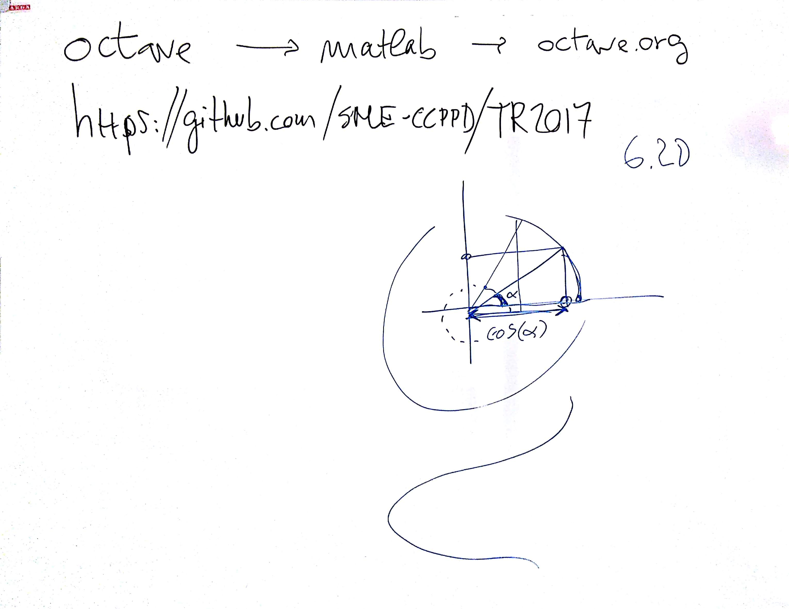

# CSEDSM 1 - Lezione del 14 novembre 2018

## Argomenti

* Introduzione a `octave`:
  * principi di funzionamento:
    * vettori: definizione, inizializzazione (lineari e matrici)
    * aritmetica vettoriale: matriciale, membro a membro
    * simboli speciali: `pi`
    * plotting
  * `help` inline
  * lavoro con files
* realizzazione di una funzione cosinusoidale campionata

## Lavagne




## Esempi `octave`

[Funzione cosinusoidale campionata](./cos1.m)

```matlab
fc=200; %frequenza di campionamento
passo=1/fc; %passo di campionamento
dur = 2; %durata tempo
start = 20; % tempo d'inizio
t = [start : passo : start+dur-passo]; %asse dei tempi
f=7; %frequenza
y =cos(f*2*pi*t); %coseno valori del tempo * (f*2*pi)
plot(t,y)
```

Questo script produce il seguente plot:


