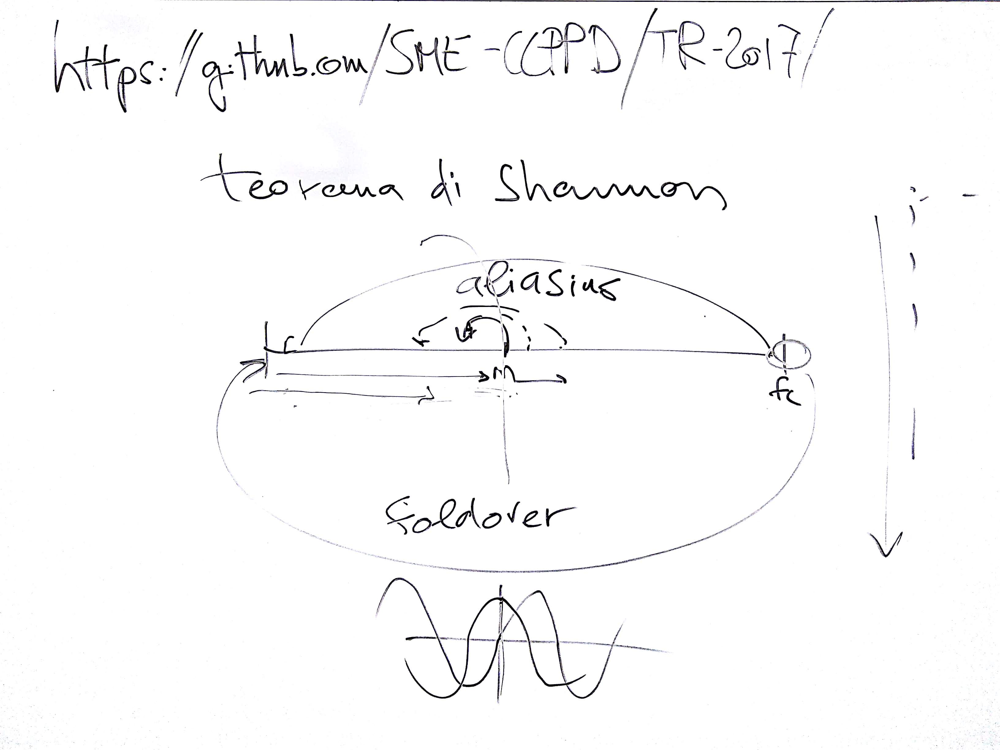
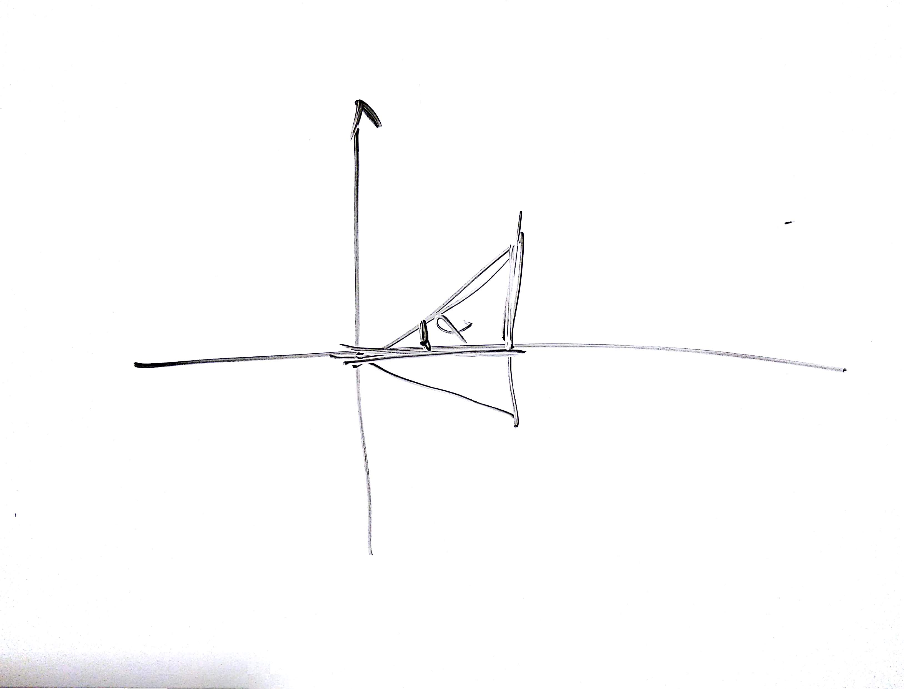
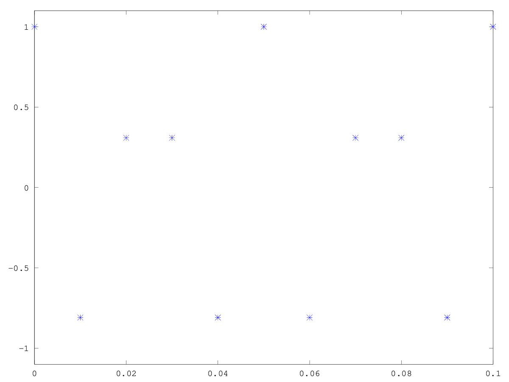
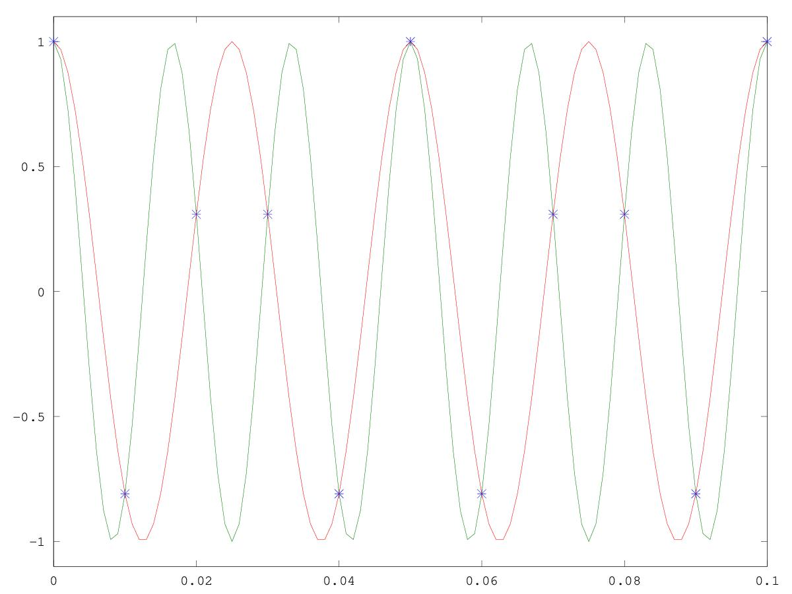

# CSEDSM 1 - Lezione del 28 novembre 2018

## Argomenti

* campionamento
  * *aliasing*
  * *foldover*

## Lavagne





## Codice `octave`

[aliasing (fc=100 Hz, f = 60 Hz -> risultante: 40 Hz)](./Camp1.m)


```matlab
dur=1;
fc=100;
step=1/fc;
t=[0:step:dur-step];  %asse dei tempi
f=60;
w=f*2*pi;
y=cos(w*t);
plot(t,y,"*")
axis([0 0.1 -1.1 1.1])   %vedo solo il primo decimo di secondo
```

Questo script produce il plot:



[aliasing (2 frequenze di campionamento, verifica che 60 e 40 Hz passano dagli stessi punti)](./Camp2.m)


```matlab
dur=1;
fc=100;
fc2=1000;
step=1/fc;
step2=1/fc2;
t=[0:step:dur-step];  %asse dei tempi
f=60;
f3=40;
t2=[0:step2:dur-step2];  
w=f*2*pi;
w3=f3*2*pi;
y=cos(w*t);
y2=cos(w*t2);
y3=cos(w3*t2);
plot(t,y,"*",t2,y2,t2,y3);
axis([0 0.1 -1.1 1.1])
```

Questo script produce il plot:


