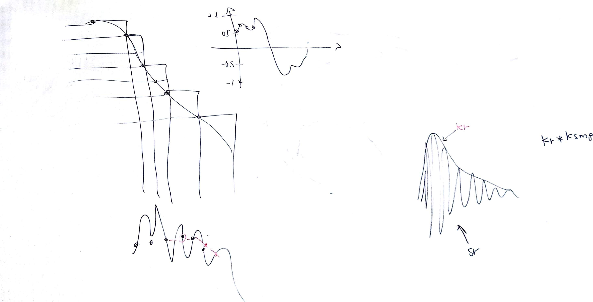
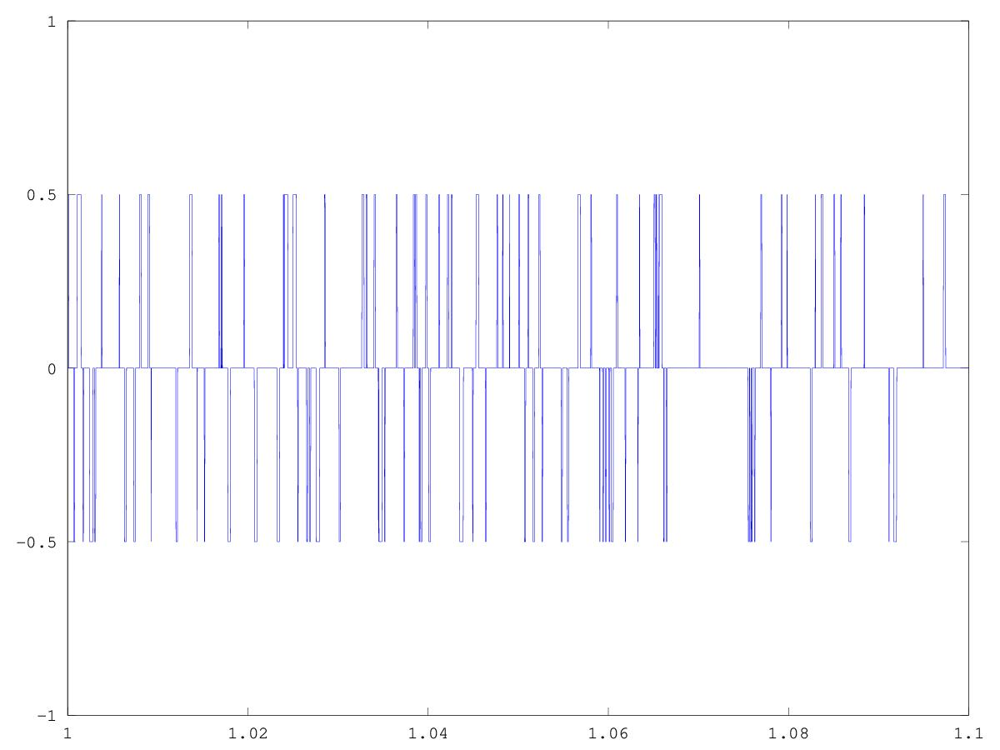
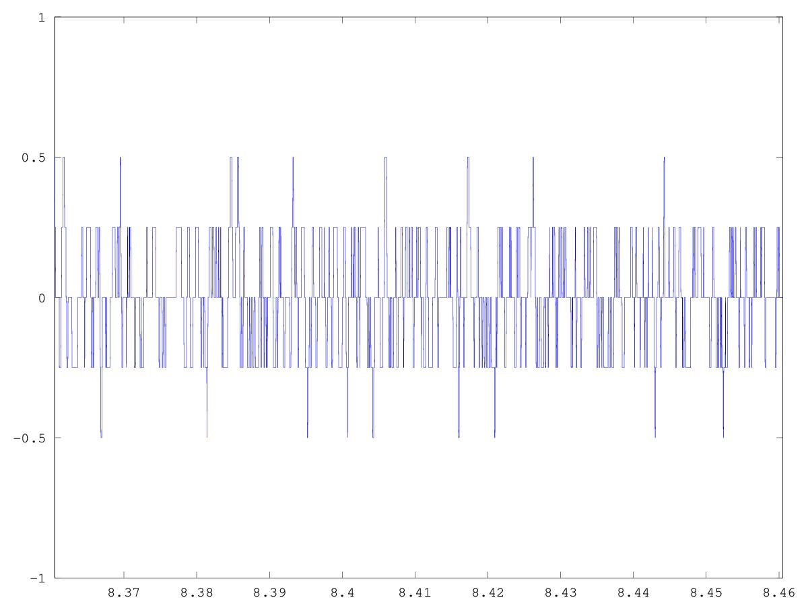
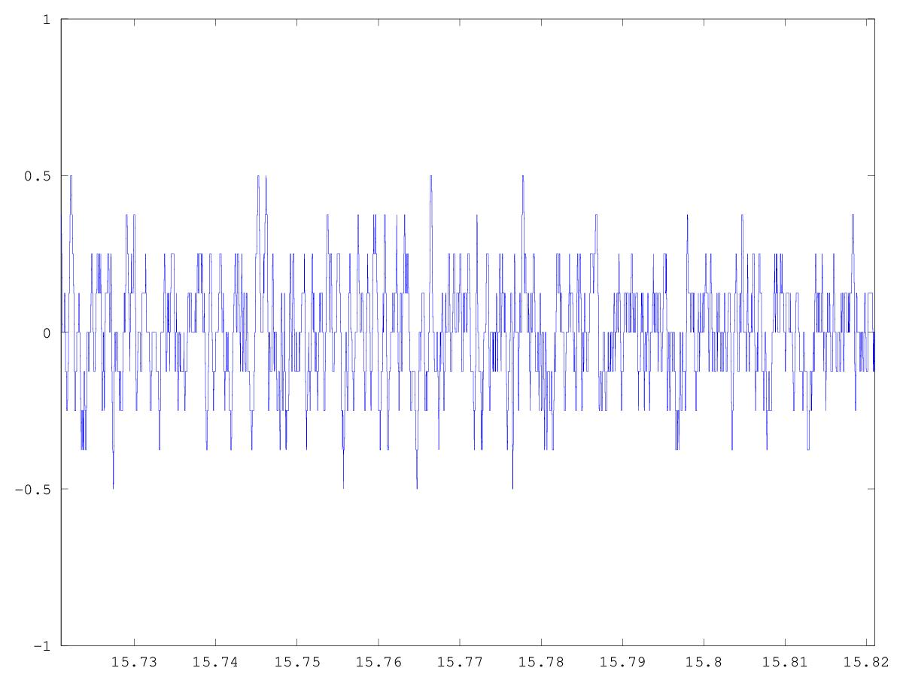
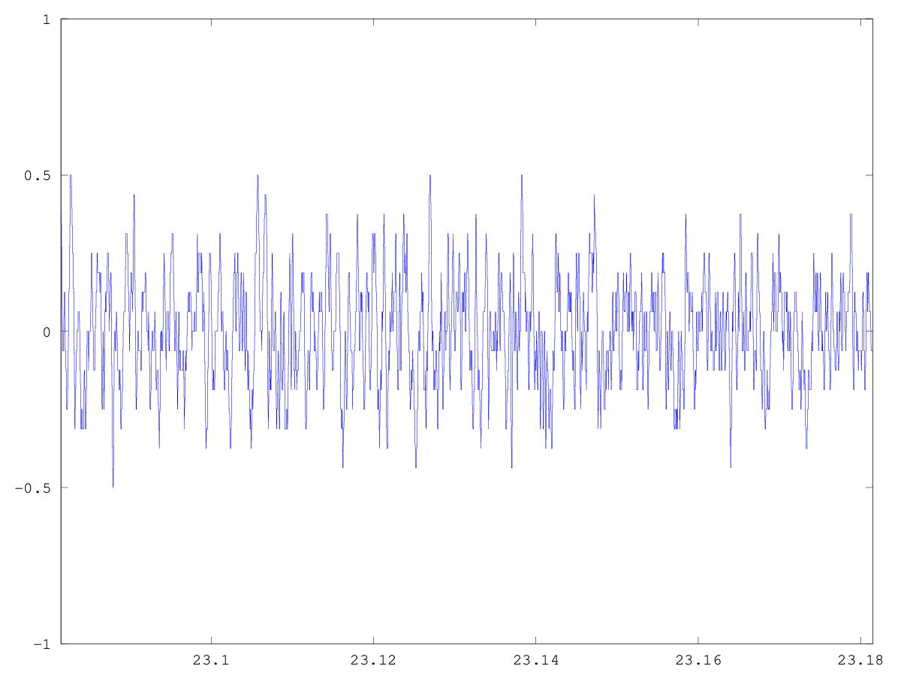
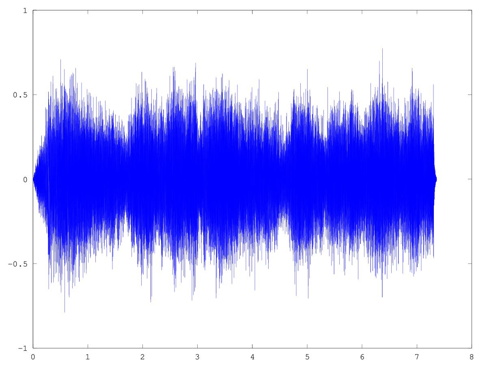
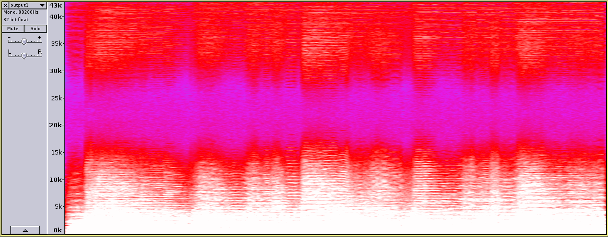

# CSEDSM 1 - Lezione del 12 dicembre 2018

## Argomenti

* quantizzazione
  * esempi di errore di quantizzazione
* *oversampling*
  * interpolazione lineare
  * punti random

## Lavagne



## Codice `octave`

### [quantizzazione progressiva da 2 a 16 bit](./quantizzatore.m)

```matlab
[Y, FS] = audioread ("../audio/webern-op1-theme.wav");
Y=Y';
NB = [2:16];
step=1/FS;%passo di campionamento
dur= length(Y)/FS;%durata del segnale 
t2=[0:step:(dur*length(NB))-step];%tempo


OUT=zeros(1,(length(NB))*length(Y));%ARRAY VUOTO, CON NUMERO DI COLONNE = CAMPIONI DEL SEGNALE * LE VARIE FREQUENZE DI CAMP.

for(j=1:length(NB))%for per ogni fc, riempio il vettore temp
     nstep=2^(NB(j)-1);%ricavo il passo
     temp = round((Y+1)*nstep);
     temp = (temp/nstep)-1;   
     inizio=(j-1)*length(Y)+1;%variabile per definire il punto di inizio in cui scrivere dentro OUT
     fine=inizio+length(Y)-1;%variabile per definire il punto in cui smettere di scrivere dentro OUT
     OUT(1,inizio:fine)=temp;%ad ogni ciclo riempio l'array col segnale campionato
end


plot(t2, OUT);
audiowrite ("output.wav", OUT, FS);
```

Questo codice produce un plot che può essere letto riadattando le ascisse in
alcune zone da 100 msec:



Quantizzazione a due bit.



Quantizzazione a tre bit.



Quantizzazione a quattro bit.



Quantizzazione a cinque bit.

Ecc.

### [oversampling](./oversampling.m)

```matlab
[Y, FS] = audioread ("../audio/webern-op1-theme.wav");
Y=Y';
step=1/FS;%passo di campionamento
dur= length(Y)/FS;%durata del segnale 
t=[0:step:(dur)-step];%tempo
FS2=2*FS;
step2=1/FS2;
t2=[0:step2:dur-step2];
OUT=zeros(1,2*length(Y));%ARRAY VUOTO, CON NUMERO DI COLONNE = CAMPIONI DEL SEGNALE * 2
OUT(1,1)=Y(1,1);
idx = 2; 
for(k=2:length(Y))
    medium = (Y(1,k)-Y(1,k-1))/2+Y(1,k-1); 
    
    OUT(1,idx) = medium;
    idx+=1;
    OUT(1,idx) = Y(1,k);
    idx+=1;
end


plot(t2, OUT);
audiowrite ("output1.wav", OUT, FS2);
```

Questo codice produce il risultato seguente:



il cui spettrogramma è il seguente:


