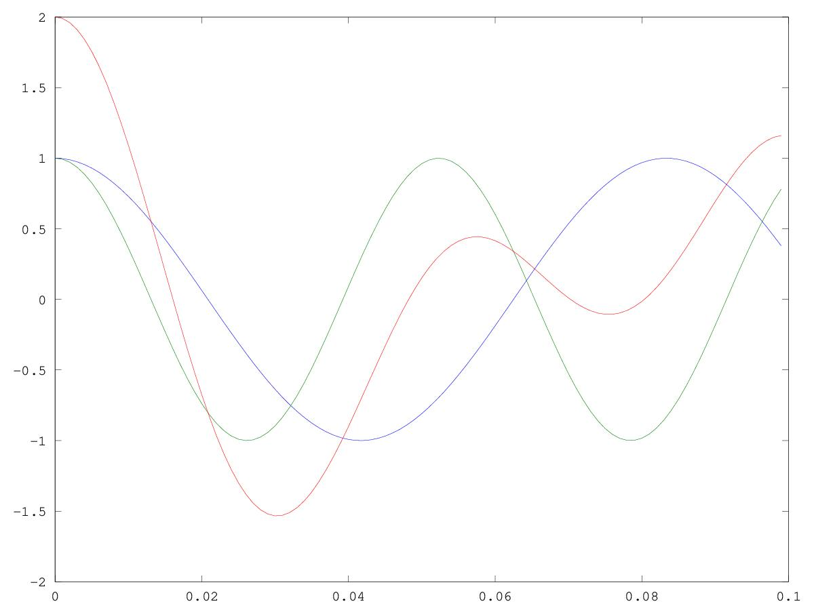

# CSEDSM 1 - Lezione del 19 dicembre 2018

## Argomenti

* linearità
  * moltiplicazioni tra segnali e scalari
  * somme di segnali
    * somme correlate e somme scorrelate
* tempo-invarianza
  * shift temporali
* tempo-varianza
* ripasso funzioni di variabile complessa
  * significato della variabile `i`
  * formula di Eulero con corollari

## Lavagne:


## Codice `octave`:

[dimostrazione di linearità](./linear.m)

```matlab
fc=1000;
sinc=1/fc;
dur=0.1;
t=[0:sinc: dur-sinc];
f=12;
sig1=cos(2*pi*f*t);
sig2=sig1;

figure(1)
plot(t, sig2,t,sig2+sig1)
figure(2)
sig3=cos(2*pi*f*t+pi/7);
plot(t, sig1, t,sig3, t,sig1+sig3)
figure(3)
sig4=cos(2*pi*(f*1.593)*t);
plot(t, sig1, t,sig4, t,sig1+sig4)
```
Questo codice produce i seguenti grafici:

*Somma di due segnali identici (correlati)*


*Somma di due segnali identici fuori fase (pseudo-correlati)*


*Somma di due segnali non correlati*



Abbiamo anche fatto degli esercizi da linea di comando sui numeri complessi
che possono essere recuperati attraverso [questo file](./numericomplessi.m)
scaricandolo e digitando:

```matlab

>>> load numericomplessi.m
```

e ispezionando tutte le variabili (`a`, `b`, `dur`, `f`, `fc`, `fz`, `fz2`,
`p`, `sig1`, `sig2`, `sig3`, `sig4`, `t`, e `z`), così:

```matlab
>>> a
>>> b
>>> # ecc..
```
