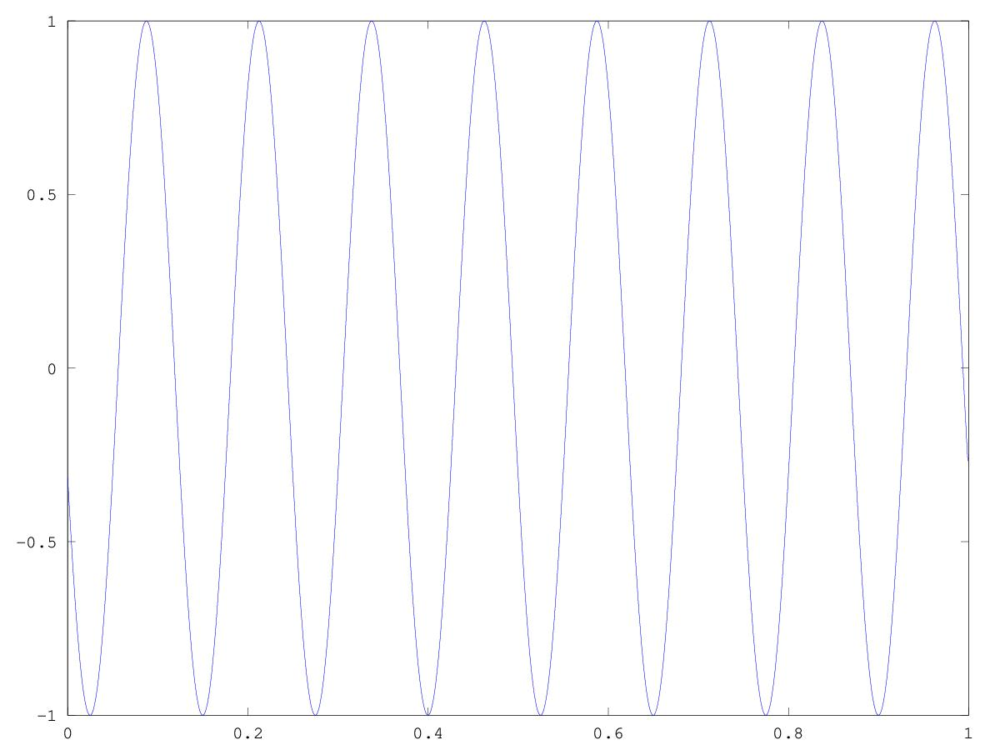
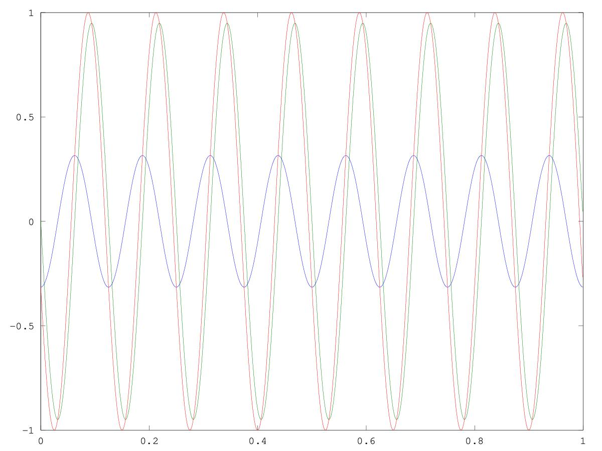
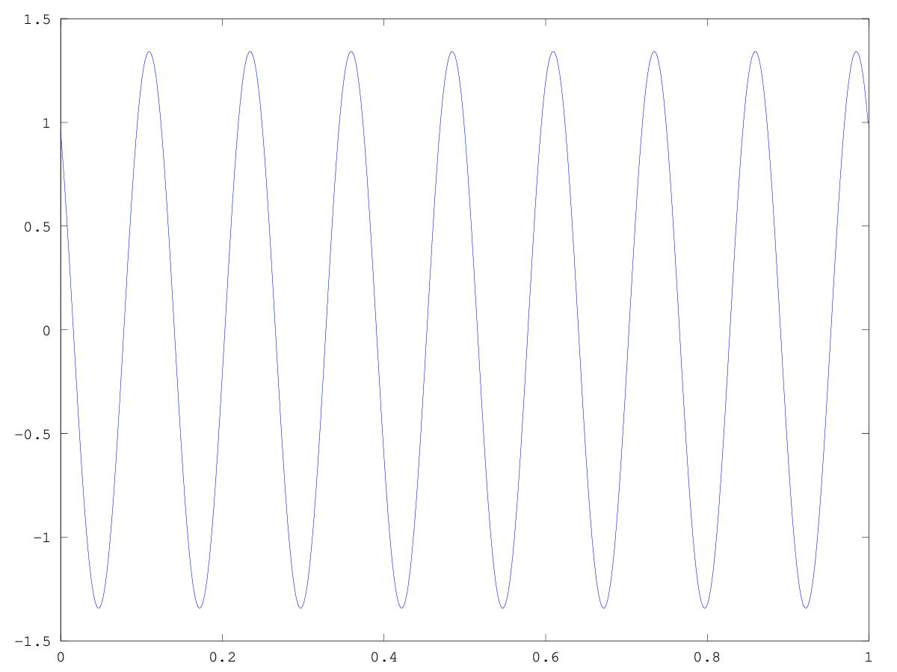

# CSEDSM 1 - Lezione del 9 gennaio 2019

## Argomenti

* ripasso di trigonometria su funzioni combinazione di seni e coseni
* ripasso funzioni di variabile complessa
  * formula di Eulero con corollari

## [Codice `octave` per verificare le somme di seni e coseni con la stessa frequenza](./lez20190109.m)

```matlab
fc=1000;
pc=1/fc;
dur=1;
t=[0:pc:dur-pc];
freq=8;
w=freq*2*pi;
fase=14.458;
y=cos(w*t+fase);
plot(t,y);

partecos=cos(fase)*cos(w*t);
partesen=-sin(fase)*sin(w*t);
y2=partecos.+partesen;
figure(2)
plot(t,partecos,t,partesen,t,y2);

figure(3)
y3=e.^(i*(w*t+fase));
plot(t,y3);

figure(4)
y4=(cos(w*t)*sin(fase))+i*(cos(w*t)*sin(fase)+sin(w*t)*cos(fase))-(sin(w*t)*sin(fase));
plot(t,y4);
```

Questo codice produce i grafici che seguono:

### funzione coseno + fase (14.58 radianti)



### scomposizione in componenti seno/coseno a fase zero



### realizzazione della funzione complessa con la stessa frequenza e fase


### sviluppo della funzione complessa


