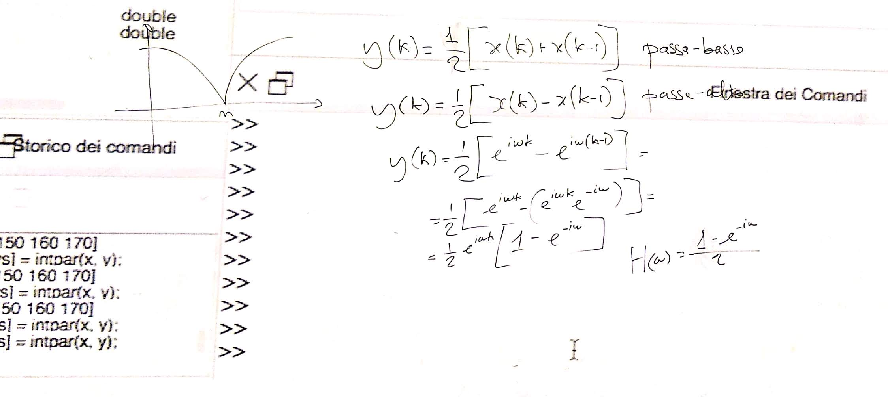
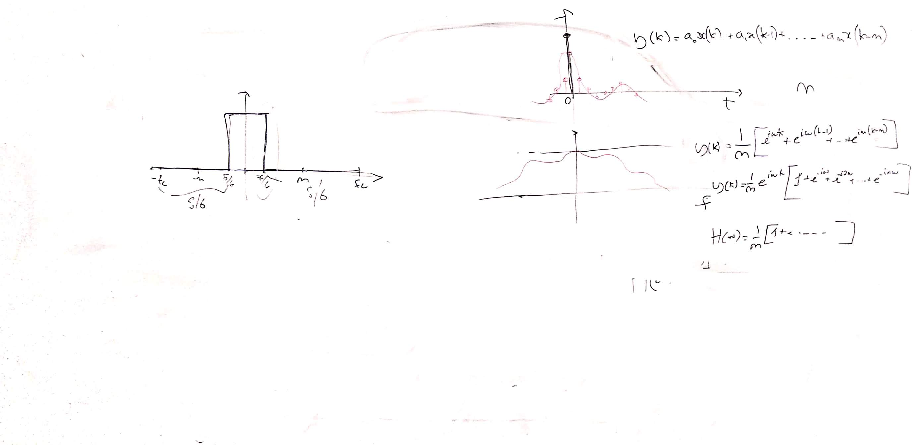
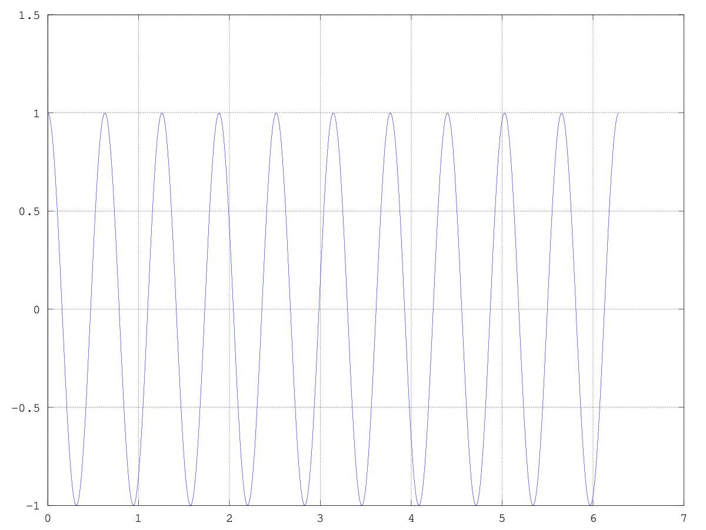
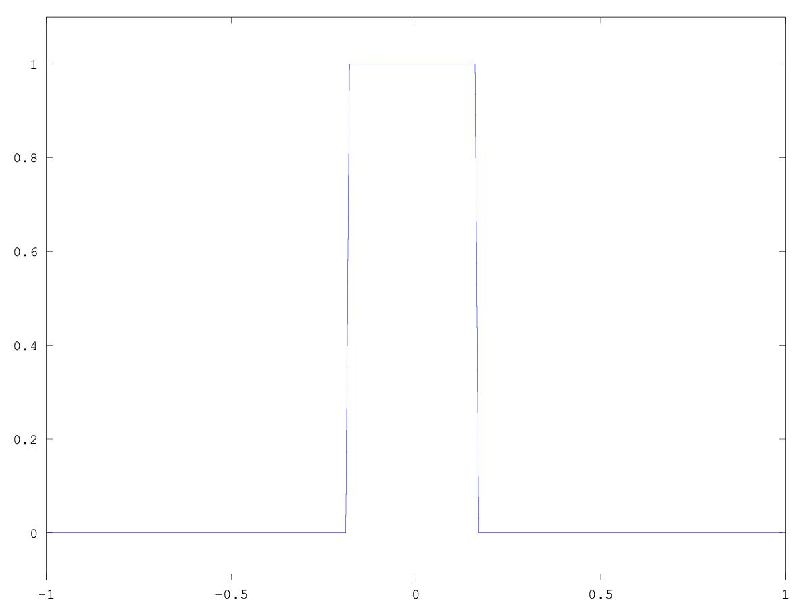
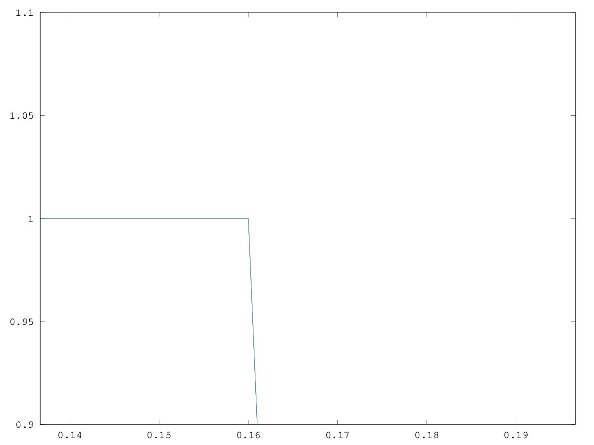
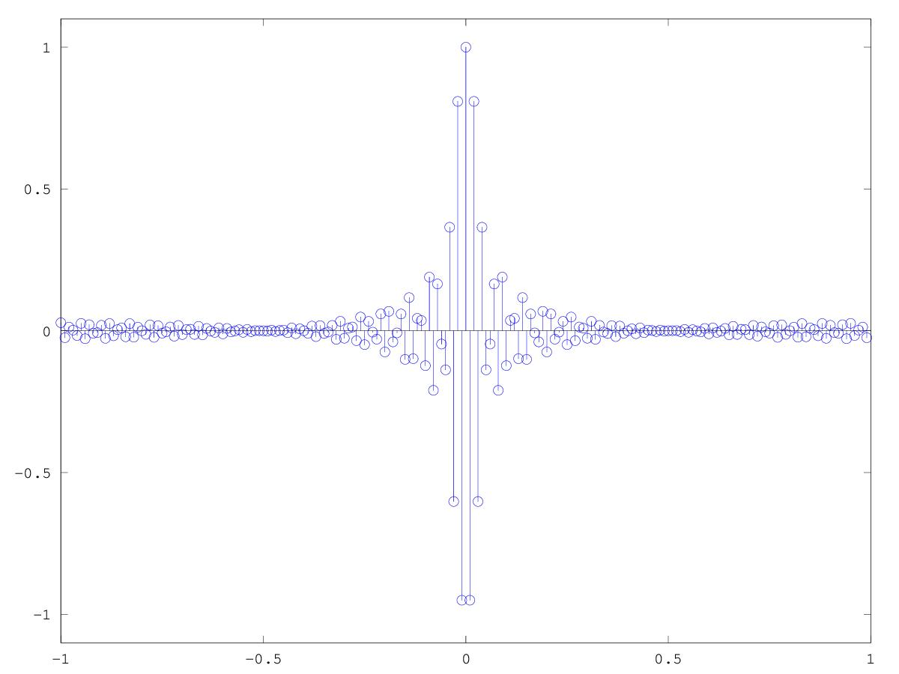

# CSEDSM 1 - Lezione del 7 febbraio 2019

## Argomenti

* Estensione dei filtri di media `one zero`:
  * realizzazione di un filtro passa-alto
* Estensione logica dei filtri FIR:
  * come realizzare un filtro *brickwall* (filtro ideale)
  * fft, ifft e risposta all'impulso...

## Lavagne





## Codice `octave`

[filtro `one zero` passa alto](./highpass.m)

```matlab
w=[0 :0.01: 2*pi];
H=(1-(e.^(-i*w)))/2;
plot(w, H)
```

La risposta in frequenza di questo filtro è:


[filtro di media `comb`](./high_average_lp.m)

```matlab
n=10;
w=[0:0.01:2*pi];

H=zeros(1, length(w));
for m=0:n
H.+=(1/(n+1))*(e.^(-i*n*w));
end

plot(w, (H))
```
La risposta in frequenza di questo filtro è:


 
La risposta in frequenza di questo filtro è:



La generalizzazione di un filtro FiR permette di realizzare un filtro con
risposta (quasi) ideale (*brickwall*). Si realizza la *trasformata inversa di
Fourier* su una risposta in frequenza desiderata ottenendone così la risposta
all'impulso. Detta risposta all'impulso è la sequenza dei coefficienti
necessari al filtro per il filtraggio voluto. [Questo è lo schema di base](./FIR_1.m):

```matlab
fc=1;
ny=fc/2;
step=0.01;
f=[-fc:step:fc-step];
t=f;
w=f*2*pi;
cutoff=ny/3;
rf=zeros(1, length(f));
rf(round(length(f)*(5/12)):round(length(f)*(7/12)))=1;
figure(1)
plot(f, rf)
axis([-1 1 -0.1 1.1])

ir=fftshift(ifft(rf));
irmax=max(ir);
ir=ir/irmax;

figure(2)
stem(t, ir)
axis([-1 1 -1.1 1.1])

figure(3)
rffft=fft(ir);

rffftmag=abs(rffft);
rffftmagmax=max(rffftmag);
rffftmag=rffftmag/rffftmagmax;

plot(f, rf, f, rffftmag)
where=1/6;

axis([where-3*step where+3*step 0.9 1.1])
```

Questo codice `octave` genera i grafici che seguono:






