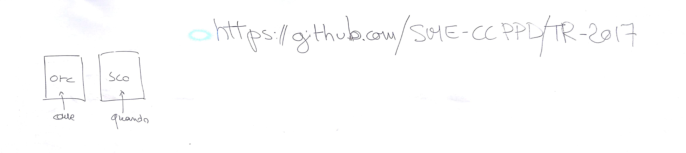

# IM 2 - Lezione del 5 dicembre 2018

## Argomenti

* Uso del Software Libero
* Strumentario e concetti di *strumento musicale*:
  * causalità e non causalità
  * compilatori di suoni:
    * `csound` - introduzione:
      * metafora *orchestra*/*partitura*
      * file `.csd` unificato
      * tipi di variabili: `a-`, `k-`, `i-`, `p-`, ecc.
      * esempio pratico

## Lavagne



## [Esempio pratico di `csound` n.1](./primo.csd)

```csound
<CsoundSynthesizer>
<CsOptions>
-odac -d
</CsOptions>
<CsInstruments>

sr = 4410
ksmps = 32
nchnls = 1 ;number of channels
0dbfs = 1

instr 1
aout oscil ampdbfs(-3), p4, p5 ;ampiezza, f, num "tavola"
out aout
endin 


</CsInstruments>
<CsScore>
f1 0 4096 10 1 ;che cos'è (la tav 1 a cui è collegata l'osc), quando avviene, dimensione tav, tipo di tavola, 1=sinusoide (dopo armoniche)
f2 0 2048 10 1 0.5 0.33 0.25 0.2 0.125 0.0625 
i1 0 2 440 1        ;qnd inizia con "i": instanziazione di uno strum, durata
i1 2.3 0.3 523 2
</CsScore>
</CsoundSynthesizer>
```
