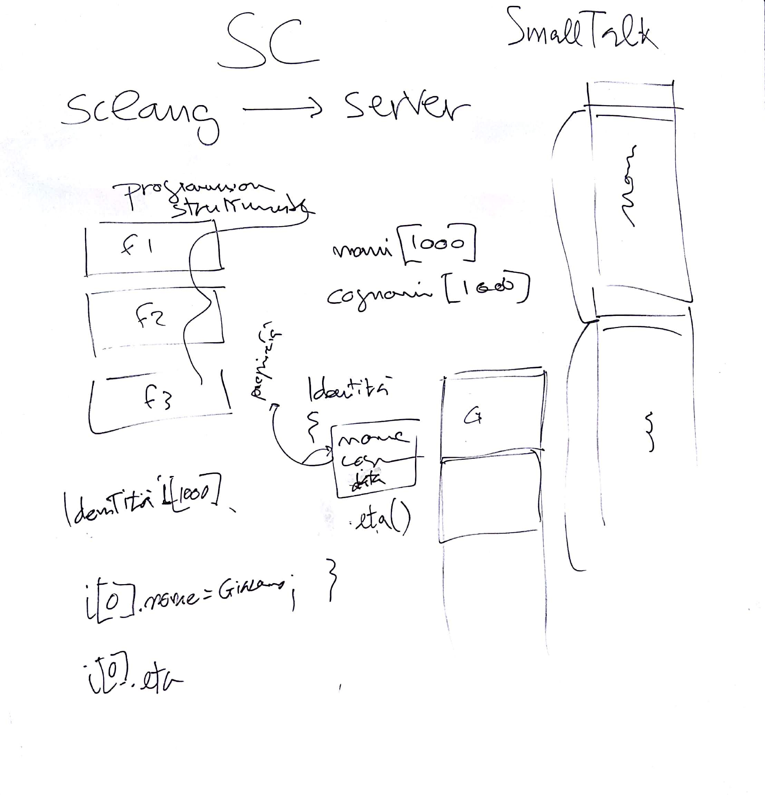

# IM 2 - Lezione del 19 dicembre 2018

## Argomenti

* Strumentario e concetti di *strumento musicale*:
  * compilatori di suoni:
    * `SuperCollider` - introduzione:
      * programmazione strutturata
      * programmazione a oggetti
      * struttura *client-server*

# Lavagne

